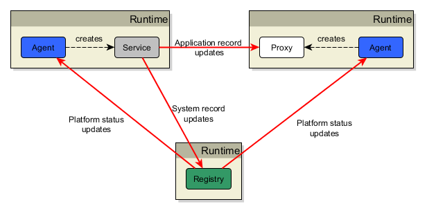

## Platform Concepts

This is an example diagram showing all the components of a ClearConnect platform and their general interaction. 



**Note:** a service can support **multiple** proxies and an agent can construct **multiple** services and proxies. For compactness, this diagram is only showing single construction and connection.

| Process type | Purpose |
| --- | --- |
| Registry | The registry is the core of the platform. The registry has a name which identifies the platform instance. It knows about all platform services and how to connect to them. If the registry is lost, **existing data connections are unaffected**. When a registry restarts, all agents re-register all platform services with the registry. |
| Agent | An agent connects to one, and only one, registry and is used to create _Service_ and _Proxy_ components. Through the registry connection, the agent has visibility of all services on the platform. The agent registers the services it creates with the registry. In general there is one agent per Java runtime. |
| Service | A service creates records and publishes updates to the records. Atomic changes to the records are published to subscribers (service proxy instances). A service can also publish remote procedure calls (RPC) that connected service proxy instances can invoke. |
| Proxy | A service proxy connects to one, and only one, service and subscribes for real-time record updates from that service. The proxy only receives the changes to records it subscribes for. The proxy can also invoke RPCs on the connected service. |

_**Note:**_
- A platform registry defines a single, distinct, ClearConnect platform instance.
- A platform is defined by the agents, services and proxies that are connected to the platform registry.

As an observation, the Registry-Agent relationship follows the same behaviour as the Service-Proxy relationship; the agent subscribes for records from the registry and can (and does) invoke RPCs on the registry.

### Data flow

Data flow is **one-way** between a service and proxy; from service to proxy. The service holds the records that change and distributes the changes to the connected proxies that have subscribed for the records. This reflects a general pattern that exists in all real-time data systems; data updates flow from publisher to subscriber. A proxy cannot change any records in a service.

In contrast to this, RPC invocation is in the opposite direction; from proxy to service. This also reflects another general pattern in real-time data systems where the publisher exposes control procedures that can be invoked by the subscribers.

### How Connections are Initiated

Connections are initiated by the proxy asking the agent for connection details for the service family. The agent does this by requesting a `service info record` from the registry for the service family. The service info record includes all the parameters needed to connect to a service instance for the requested service family. The proxy then makes a connection using this information. If there is no service info record, the proxy will pause for 5000ms before asking the agent again. This cycle continues until either:

1.  the proxy connects
2.  the proxy is destroyed via a call to `agent.destroyPlatformServiceProxy(...)`.

Connections **always** start in a `DISCONNECTED` state.

The diagram below illustrates the connection state transitions
```
DISCONNECTED <-> CONNECTING -> CONNECTED
       ^                           |
       |___________________________|
```

### Connection Auto-Reconnect

If a connection between a service and a proxy closes unexpectedly (i.e. without the proxy being destroyed), the proxy re-initiates the connection to the service. When the connection is re-established, the proxy re-subscribes for all records that were previously subscribed for. This mechanism ensures that auto-reconnect occurs and also ensures that all data in the proxy is refreshed and is live.