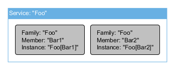

## Service Concepts

All data in the ClearConnect platform is held in records. A service provides a logical grouping for records. Application code creates a service and the records in the service. Application code also populates the records with data and publishes the atomic changes of the records for connected subscribers to receive.

### Family, members, instances

A service is identified by a _service family name_ that is unique on the platform. A service needs at least one _service instance_ for the service to exist. A service instance belongs to a single family. The service instance shares the service family name of the service it supports and identifies itself within the family with a _member name_.

The diagram above illustrates this concept. This shows a service, family name "Foo", composed of two instances with member names "Bar1" and "Bar2". Each instance is uniquely identifiable by its service family name and member name (much like individuals in a family). Thus the "Foo" service exists on the platform, composed of two service instances "Foo[Bar1]" and "Foo[Bar2]".

**Note:** the term _instance_ and _member_ can be considered synonymous when discussed in the context of a service. Technically, only service instances exist on the platform and each service instance name must be unique on the platform. This is guaranteed as;

*   a service family name is unique on the platform
*   a member name is unique within a service family

A service (specifically an instance) contains records, all identified by a unique name within the service. Records can only be updated through the service instance. In no way can any record subscriber **directly** update a record. However, a service can publish an RPC that allows proxies to update records.

### High-availability

A platform service provides fault-tolerance or load-balancing high-availability features. Both features are made possible due to a platform service being composed of one or more instances.

The two features are mutually exclusive; a service either exists as a fault-tolerant service or a load-balanced service but not both. Additionally, all members of the service must be created with the same mode.

| Mode | Description |
| --- | --- |
| Fault-tolerance | In this mode, one member in the service family is active, all other members are standby. The registry defines the active member. Should the active member drop off the platform, all proxy connections to the active member are routed to the next member in the family (as decided by the registry). This is a **warm-standby** fault-tolerance mechanism. |
| Load-balanced | This mode provides **connection** load-balancing across all members of a service. As proxy instances connect to the service, the registry assigns the next member in the service to be used, in a round-robin fashion. Should any of the service members drop off the platform, the connections it was managing are routed to the next available member, again in round-robin style. |

### Service System Records

Every service has five special records called _system records_. These capture information about the state of the service. Typically application code does not need to access these (the event listeners provide the same level of information). System records are read-only for application code.

| System record name | Purpose |
| --- | --- |
| ContextRecords | Holds the name of all the records created. |
| ContextSubscriptions | Holds the number of subscriptions per record. |
| ContextRpcs | Holds the RPCs published. |
| ContextConnections | Holds all connections and the connection attributes. |
| ContextStatus | Holds other status attribute information. |
