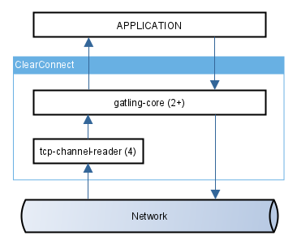

## Threading Block Diagram

The diagram below shows the threading hand-over points in ClearConnect.

By default there are 4 TCP reader threads and 2+ event threads (gatling core). 

### Event threads
These are the gatling-core threads and deal with notifying `IRecordListener` instances with received events and encoding changes to `IRecord` instances for sending to registered (potentially remote) observers.

### TCP reader threads
The TCP reader threads are responsible for assembling received TCP traffic into protocol frames. The frames are decoded by the event threads. 

The received frame decoding is decoupled from the TCP reading, this is to ensure no slow consumer situations when a TCP writer has to wait for the TCP reader to finish decoding a frame before it can start draining the next received TCP frame.

The number of TCP reader threads is determined by the system property `tcpChannel.readerThreadCount`.