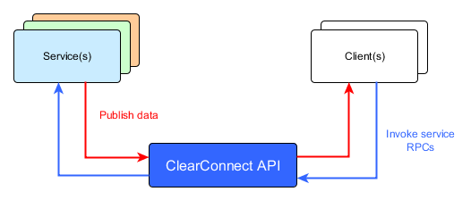

# Introduction {#introduction}

ClearConnect is an open-source micro services platform written in Java. ClearConnect enables complex applications to be decomposed into logical “micro” services that are independently deployable, scalable and discoverable.

The ClearConnect platform features:

*   real-time data transfer
*   high-availability
*   real-time monitoring and data inspection

ClearConnect makes developing distributed applications quick and easy by providing a simple application programming interface (API) and management tools.

The code is available on [GitHub](https://github.com/fimtra/clearconnect) and [Maven central](https://oss.sonatype.org/#nexus-search;quick%7Eclearconnect).