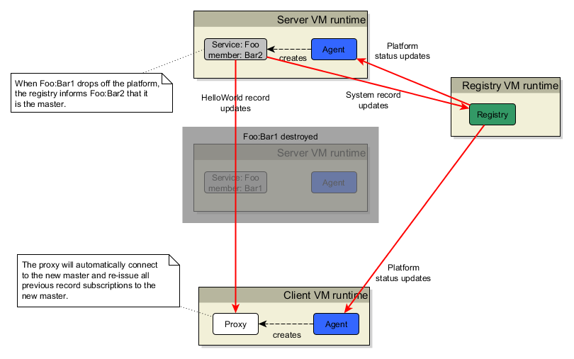

# Fault Tolerant Hello World!

One of the key features of the ClearConnect platform is its ability to allow services to be deployed in a fault-tolerant manner with almost no change to the business code. This tutorial is more advanced than the previous ones and requires four VM runtimes to be created. The code is almost identical to the hello world example, the only difference is that the member name needs to be different for each service. This runs the registry in a separate VM for the first time.

It also introduces the concept of a service being supported by one or more instances.


For a service, the master instance is the earliest to connect to the registry. If the current master disconnects, the next master is the instance that connected to the regsitry after the previous. So assuming that the Foo:Bar1 instance is started first, it will be the master.

Perform the startup in this order:
1. Registry
2. Foo:Bar1
3. Foo:Bar2
4. Client

The Foo:Bar1 console will show:
```
MASTER
```
The Foo:Bar2 console will show:
```
STANDBY
```
The client console will show:
```
Hello World (from Bar1)
```


## The code
### The registry
```java
EndPointAddress registryAddress = new EndPointAddress(TcpChannelUtils.LOCALHOST_IP, 22222);

PlatformRegistry registry = new PlatformRegistry("Hello World Platform", registryAddress);

synchronized("") { "".wait(); }
```

### Foo:Bar1
```java
EndPointAddress registryAddress = new EndPointAddress(TcpChannelUtils.LOCALHOST_IP, 22222);

PlatformRegistryAgent agent = new PlatformRegistryAgent("FooBar1-agent", registryAddress);

agent.createPlatformServiceInstance("Foo", "Bar1", TcpChannelUtils.LOCALHOST_IP, WireProtocolEnum.GZIP,
    RedundancyModeEnum.FAULT_TOLERANT);

IPlatformServiceInstance serviceInstance = agent.getPlatformServiceInstance("Foo", "Bar1");

//
// Register a listener that can be informed when the service is master or standby
//
serviceInstance.addFtStatusListener(new IFtStatusListener()
{
    @Override
    public void onStandby(String serviceFamily, String serviceMember)
    {
        System.out.println("STANDBY");
    }

    @Override
    public void onActive(String serviceFamily, String serviceMember)
    {
        System.out.println("MASTER");
    }
});

IRecord record = serviceInstance.getOrCreateRecord("HelloWorld");

record.put("a message", "Hello World (from " + serviceInstance + ")");

serviceInstance.publishRecord(record);

synchronized("") { "".wait(); }
```

### Foo:Bar2
```java
EndPointAddress registryAddress = new EndPointAddress(TcpChannelUtils.LOCALHOST_IP, 22222);

PlatformRegistryAgent agent = new PlatformRegistryAgent("FooBar2-agent", registryAddress);

agent.createPlatformServiceInstance("Foo", "Bar2", TcpChannelUtils.LOCALHOST_IP, WireProtocolEnum.GZIP,
    RedundancyModeEnum.FAULT_TOLERANT);

IPlatformServiceInstance serviceInstance = agent.getPlatformServiceInstance("Foo", "Bar2");

serviceInstance.addFtStatusListener(new IFtStatusListener()
{
    @Override
    public void onStandby(String serviceFamily, String serviceMember)
    {
        System.out.println("STANDBY");
    }

    @Override
    public void onActive(String serviceFamily, String serviceMember)
    {
        System.out.println("MASTER");
    }
});

IRecord record = serviceInstance.getOrCreateRecord("HelloWorld");

record.put("a message", "Hello World (from " + serviceInstance.getPlatformServiceMemberName() + ")");

serviceInstance.publishRecord(record);

synchronized("") { "".wait(); }
```

### Client
```java
EndPointAddress registryAddress = new EndPointAddress(TcpChannelUtils.LOCALHOST_IP, 22222);

PlatformRegistryAgent agent = new PlatformRegistryAgent("FT-client", registryAddress);

agent.waitForPlatformService("Foo");

IPlatformServiceProxy proxy = agent.getPlatformServiceProxy("Foo");

IRecordListener listener = new IRecordListener()
{
    @Override
    public void onChange(IRecord image, IRecordChange atomicChange)
    {
        System.out.println(image.get("a message").textValue());
    }
};

proxy.addRecordListener(listener, "HelloWorld");

synchronized ("") { "".wait(); }
```
The "business code" (such as it is for this simple example) for both service instances is the same; it just creates the HelloWorld record. The only difference between Foo:Bar1 and Foo:Bar2 is the service member name. This shows how multiple instances of the same service code can be easily run by simply changing the member name.

## Demonstration of fail-over
Now to demonstrate what happens when the master instance is stopped. Assuming you have started the four runtimes and seen the same output in the VM consoles as described above, let's kill the Foo:Bar1 instance. This will result in the following deployment:



What you should see in the client console is:
```
Hello World (from Bar1)
Hello World (from Bar2)
```
The client code subscribed for the HelloWorld record. When the original master dropped off the platform, the ClearConnect code re-connects to the new master and re-issues all the record subscriptions. The new master will respond with its current image for each record. This will then trigger the record listener again, hence why there are 2 lines, one from each master.

The Foo:Bar2 console will show:
```
STANDBY
MASTER
```
This shows that it transitioned from being standby to being master. _Note:_ the registry invokes an RPC on the service that informs the service of its FT status.


