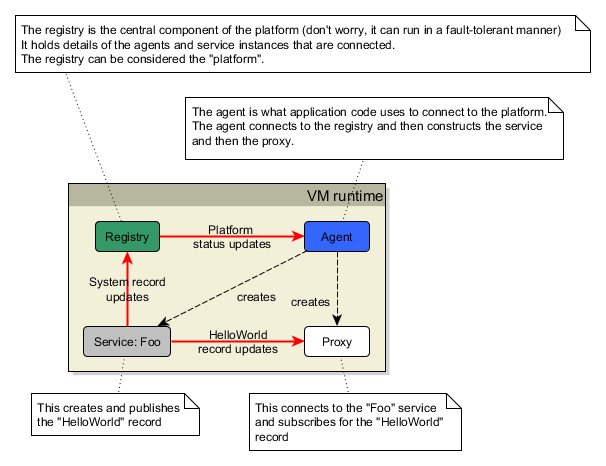
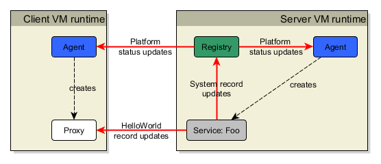

# Hello World!

The ubiquitous "hello world" example.  
Sometimes its just easier to learn by looking at a simple example...

This is what the tutorial will run in a single VM:



Running this code will output the following to the console:

```
Hello World
3.1415926535898
```

## Getting started

If you use maven, then add this dependency to your `pom.xml`

```xml
<dependency>
    <groupId>com.fimtra</groupId>
    <artifactId>clearconnect</artifactId>
    <version>3.17.2</version>
</dependency>
```

## The code

Run this code in a main method. The comments take you through what is happening.

```java
EndPointAddress registryAddress = new EndPointAddress(TcpChannelUtils.LOCALHOST_IP, 22222);

//
// The registry is the central part of the platform.
// Generally, you run this in a separate VM (but for the example, we run in the same VM).
// Note that the registry address defines the host:port the registry runs on and this is the
// address an agent uses to connect to the registry.
//
PlatformRegistry registry = new PlatformRegistry("Hello World Platform", registryAddress);

//
// An agent connects to the registry and you use the agent to construct your services and
// connections to other services.
// We give the agent a name, here "Agent1"
//
PlatformRegistryAgent agent = new PlatformRegistryAgent("Agent1", registryAddress);

//
// Using the agent, you create a service. This is the Foo:Bar1 service instance; it belongs
// to the "Foo" family of services and this particular instance is the member "Bar1".
// There can be many members of a single service (this is how the high availability works).
// It listens for connections on the IP address TcpChannelUtils.LOCALHOST_IP and the API will automatically
// assign it a server TCP port.
// It will use the "GZIP" wire protocol and is a fault-tolerant service (althouth it needs 
// other members to be created to be truly fault-tolerant)
//
agent.createPlatformServiceInstance("Foo", "Bar1", TcpChannelUtils.LOCALHOST_IP, WireProtocolEnum.GZIP,
    RedundancyModeEnum.FAULT_TOLERANT);

//
// Once created, you get your reference to the service (creating and getting are separated in the API)
//
IPlatformServiceInstance serviceInstance = agent.getPlatformServiceInstance("Foo", "Bar1");

//
// A service can create records - here we create a record
//
IRecord record = serviceInstance.getOrCreateRecord("HelloWorld");

//
// A record is like Map - we can add key-value pairs to it
// Note: only a service can update a record - a proxy can only observe a record
//
record.put("a message", "Hello World");
record.put("the time stamp", LongValue.valueOf(System.currentTimeMillis()));
record.put("pi is", DoubleValue.valueOf(3.1415926535898));

//
// Changes to a record can only be made visible to connected proxies by "publishing" the
// record with the changes that have happened since the last time it was published.
// Here we publish the record.
//
serviceInstance.publishRecord(record);

//
// Now we get a "client" to subscribe for the record from the service
//

//
// You can use the agent to "wait for" a service to become available (this will wait for 60
// seconds at most). This is useful for client code to block until it gets a signal that the
// service is available.
//
agent.waitForPlatformService("Foo");

//
// Now that we know the service is available, we can obtain a connection to it.
// The connection is encapsulated in a proxy (this is a client to the service).
// The service is called "Foo" so we get a proxy to the "Foo" service.
//
IPlatformServiceProxy proxy = agent.getPlatformServiceProxy("Foo");

//
// We create a listener that will recieve changes to records. We will simply print out the
// record and some of its fields.
//
IRecordListener listener = new IRecordListener()
{
    @Override
    public void onChange(IRecord image, IRecordChange atomicChange)
    {
        //
        // NOTE: a record image is unchanging ONLY in this method - outside this method it
        // is subject to change. So if you want to use a record later on in your code,
        // snapshot it here, like this
        //
        ImmutableRecord mySnapshot = ImmutableSnapshotRecord.create(image);

        // access some of the record fields and print them out
        System.out.println(mySnapshot.get("a message").textValue());
        System.out.println(mySnapshot.get("pi is").doubleValue());
    }
};

//
// Using the proxy we observe the record by adding the listener against the record name 
// "HelloWorld"
//
proxy.addRecordListener(listener, "HelloWorld");

//
// All the internal threads in ClearConnect are daemon so the VM will exit at the end of the main method
// Hence, give some time for the listener code to execute to display what was received 
//
Thread.sleep(1000);
```

# Distributed Example

The simple example can be extended to demonstrate how it can work in a distributed environment.  
In the next example, a second VM is run that constructs a proxy to the service and subscribes for the HelloWorld record. Its the same code as in the simple example but split so the server and client parts run in separate VMs.

_Note:_ the registry is run in the server VM only for convenience of this example. In reality it should run in its own, separate and dedicated VM.



It doesn't matter in which order you run the code - eventually if both runtimes are executing the connections will be made.

## The code for server runtime

```java
EndPointAddress registryAddress = new EndPointAddress(TcpChannelUtils.LOCALHOST_IP, 22222);

PlatformRegistry registry = new PlatformRegistry("Hello World Platform", registryAddress);

// NOTE: agent names MUST be unique in a platform
PlatformRegistryAgent agent = new PlatformRegistryAgent("Server-helloworld", registryAddress);

agent.createPlatformServiceInstance("Foo", "Bar1", TcpChannelUtils.LOCALHOST_IP, WireProtocolEnum.GZIP,
    RedundancyModeEnum.FAULT_TOLERANT);

IPlatformServiceInstance serviceInstance = agent.getPlatformServiceInstance("Foo", "Bar1");

IRecord record = serviceInstance.getOrCreateRecord("HelloWorld");

record.put("a message", "Hello World");
record.put("the time stamp", LongValue.valueOf(System.currentTimeMillis()));
record.put("pi is", DoubleValue.valueOf(3.1415926535898));

serviceInstance.publishRecord(record);

// wait forever as this is the "server" VM
synchronized("")
{
    "".wait();
}
```

## The code for the client runtime

```java
EndPointAddress registryAddress = new EndPointAddress(TcpChannelUtils.LOCALHOST_IP, 22222);

PlatformRegistryAgent agent = new PlatformRegistryAgent("Client-helloworld", registryAddress);

agent.waitForPlatformService("Foo");

IPlatformServiceProxy proxy = agent.getPlatformServiceProxy("Foo");

IRecordListener listener = new IRecordListener()
{
    @Override
    public void onChange(IRecord image, IRecordChange atomicChange)
    {
        // access some of the record fields and print them out
        System.out.println(image.get("a message").textValue());
        System.out.println(image.get("pi is").doubleValue());
    }
};

proxy.addRecordListener(listener, "HelloWorld");

Thread.sleep(1000);
```


