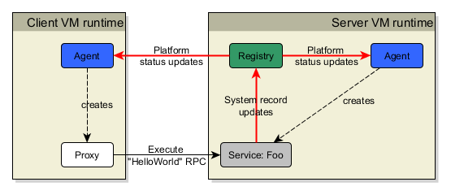

# Hello World RPC!
Hopefully you have looked at and understood the [Hello World](hello_world.md) tutorial. This tutorial builds on the previous concepts and introduces calling an RPC.

This is what this tutorial will run in a single VM:


Running this code will output the following to the console:
```
Hello world!
```

## The code

```java
EndPointAddress registryAddress = new EndPointAddress(TcpChannelUtils.LOCALHOST_IP, 22222);

PlatformRegistry registry = new PlatformRegistry("Hello World Platform", registryAddress);

PlatformRegistryAgent agent = new PlatformRegistryAgent("Agent1", registryAddress);

agent.createPlatformServiceInstance("Foo", "Bar1", TcpChannelUtils.LOCALHOST_IP, WireProtocolEnum.STRING,
    RedundancyModeEnum.FAULT_TOLERANT);

IPlatformServiceInstance serviceInstance = agent.getPlatformServiceInstance("Foo", "Bar1");

//
// Now construct the RPC.
// The RPC is analogous to: String helloWorld_RPC(String echoBack) { return echoBack; }
//
IRpcExecutionHandler handler = new IRpcExecutionHandler()
{
    @Override
    public IValue execute(IValue... args) throws TimeOutException, ExecutionException
    {
        //
        // Here is where the logic for the RPC goes
        // For this example, we simply echo back the argument
        //
        return args[0];
    }
};
TypeEnum returnType = TypeEnum.TEXT;
String rpcName = "helloWorld_RPC";
String[] argNames = new String[] {"echoBack"};
TypeEnum argTypes = TypeEnum.TEXT;
IRpcInstance rpc = new RpcInstance(handler, returnType, rpcName, argNames, argTypes);

//
// Now publish the RPC - after this it is available for execution by clients (proxies)
//
serviceInstance.publishRPC(rpc);

//
// Now we get a "client" to be able to invoke the RPC
//
agent.waitForPlatformService("Foo");

IPlatformServiceProxy proxy = agent.getPlatformServiceProxy("Foo");

//
// The timeout defines how long the execution will wait for discovering the RPC if it is not
// available when the code is executed. In a distributed environment you are not guaranteeed
// that all distributed resources are available so we provide this facility to allow for the
// RPC to become available.
//
long discoveryTimeoutMillis = 5000;
final IValue result = proxy.executeRpc(discoveryTimeoutMillis, "helloWorld_RPC", TextValue.valueOf("Hello world!"));

System.out.println(result.textValue());
```
# Distributed Example
As with the previous helloworld example, we can run the RPC helloworld example in a distributed manner, separating the client and server components into distinct runtimes. Again, its the same code but simply split to run in different runtimes.

*Note again:* the registry is run in the server VM only for convenience of this example. In reality it should run in its own, separate and dedicated VM.



## The code for server runtime
```java
EndPointAddress registryAddress = new EndPointAddress(TcpChannelUtils.LOCALHOST_IP, 22222);

PlatformRegistry registry = new PlatformRegistry("Hello World Platform", registryAddress);

PlatformRegistryAgent agent = new PlatformRegistryAgent("Server-helloworld", registryAddress);

agent.createPlatformServiceInstance("Foo", "Bar1", TcpChannelUtils.LOCALHOST_IP, WireProtocolEnum.STRING,
    RedundancyModeEnum.FAULT_TOLERANT);

IPlatformServiceInstance serviceInstance = agent.getPlatformServiceInstance("Foo", "Bar1");

IRpcInstance rpc = new RpcInstance(new IRpcExecutionHandler()
{
    @Override
    public IValue execute(IValue... args) throws TimeOutException, ExecutionException
    {
        return args[0];
    }
}, TypeEnum.TEXT, "helloWorld_RPC", new String[] {"echoBack"}, TypeEnum.TEXT);

serviceInstance.publishRPC(rpc);

//wait forever as this is the "server" VM
synchronized("")
{
 "".wait();
}
```

## The code for the client runtime
```java
EndPointAddress registryAddress = new EndPointAddress(TcpChannelUtils.LOCALHOST_IP, 22222);

PlatformRegistryAgent agent = new PlatformRegistryAgent("Client-helloworld", registryAddress);

agent.waitForPlatformService("Foo");

IPlatformServiceProxy proxy = agent.getPlatformServiceProxy("Foo");

long discoveryTimeoutMillis = 5000;
final IValue result = proxy.executeRpc(discoveryTimeoutMillis, "helloWorld_RPC", TextValue.valueOf("Hello world!"));

System.out.println(result.textValue());
```