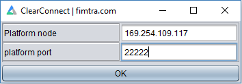
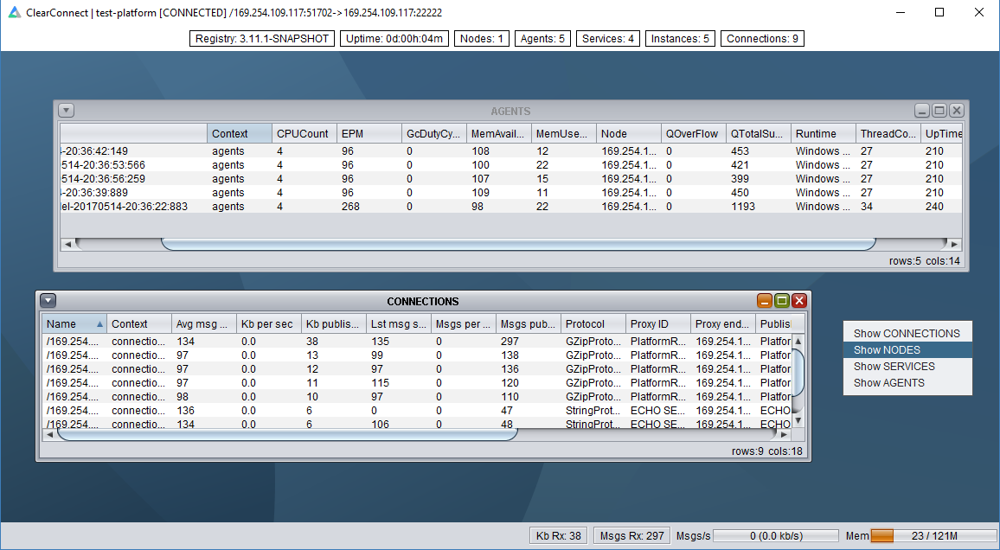
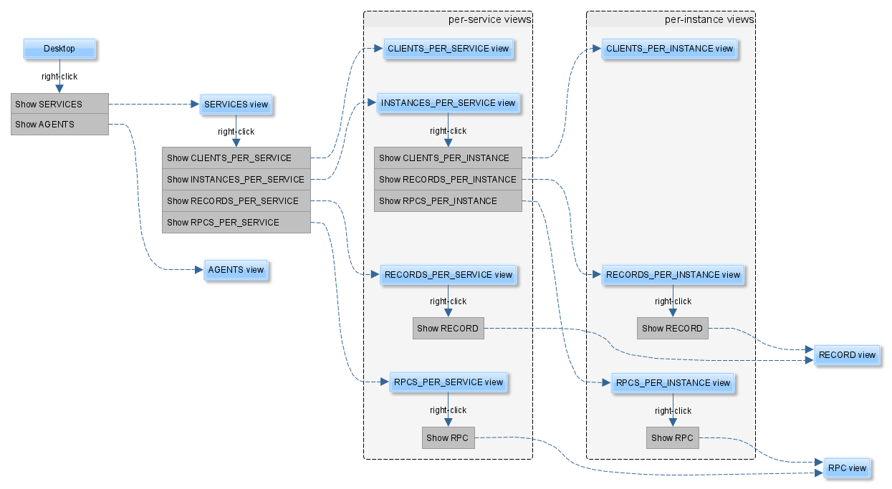

### Platform Desktop {#platform-desktop}

The ClearConnect platform has a built in graphical interface tool for investigating and visualising all services and data running on the platform. The tool is called the 'platform desktop' and is run by executing the main method of the class `com.fimtra.clearconnect.core.PlatformDesktop`

When it starts, the user is prompted to enter endpoint information for the platform that it will connect to:

The screenshot below shows the desktop running on a platform called "test-platform".

The interface uses a context menu (right-click menu) user interaction model. Right-clicking on the desktop shows the first level navigation options. In the screenshot below, the AGENTS and CONNECTIONS views have been opened and the context menu is shown with the NODES being selected for viewing.

The rows in each view may have further context menu navigation to open up further windows showing context information of the selected row. This allows a drill-down investigation of services and data in the platform. A full map of navigation of the various views is shown later on.

#### Behaviour {#behaviour}

*   All data in the desktop is live data on the platform.
*   The view windows can be resized, repositioned within the confines of the desktop.
*   Columns in each view can be re-ordered and re-sized.
*   Clicking on the column header will sort the rows in ascending/descending order for the data in the column. Sorting does not occur on updates of data (the rows will not auto order as data changes).
*   Changes in any cell value are highlighted by the background flashing red for 1 second then reverting.
*   The desktop frame, size, position and the internal view positions, sizes, column orders, column widths are all saved on exit. The layout information is held in a file in the working-directory called `PlatformMetaDataModel_[platform name].ini`. This allows multiple platforms to have different layouts saved.
*   When viewing records, if the service disconnects the connection will automatically be retried until the service returns or the window closed. The table background colour signals the state:
    *   Yellow – retrying connection
    *   Orange – disconnected

Note: sub-maps viewable by double-clicking on the `SubMap...` text.

#### Platform Desktop Navigation {#platform-desktop-navigation}

The diagram below illustrates the navigation drill-down paths available in the PlatformDesktop. The views are described in the next section.

#### Platform Desktop Views {#platform-desktop-views}

The table below describes each of the views and the attributes associated with each one. Generally, statistic-type attributes update at 10 second intervals (e.g. messages received, Kb received). Services (and instances) appear as soon as they are registered with the platform registry. Services disappear from desktop views when the platform registry detects that the service instance is no longer available (so this can be subject to heartbeats being missed before the service is removed, these are discussed later on).

| View | Purpose |
| --- | --- |
| SERVICES | Shows all the service families running on the platform. |
| AGENTS | Shows all agents running on the platform. In general, there should be one agent per VM (although this is not enforced). The agents view provides an insight into the runtime that hosts one (or more) services. |
| CLIENTS_PER_SERVICE | Shows the clients connected to a service family. This includes all service instances for the family so provides a grouped connection view per service family. |
| INSTANCES_PER_SERVICE | Shows the all the running members (instances) for a service family. Similar to the INSTANCES_PER_NODE view. |
| RECORDS_PER_SERVICE | Shows all the records in a service family. This is an aggregated view the records across all running member instances of the service family. |
| RPCS_PER_SERVICE | Shows all the RPCs in a service family. This is an aggregated view of RPCs across all running member instances of the service family. |
| CLIENTS_PER_INSTANCE | Shows the clients attached to a service instance. |
| RECORDS_PER_INSTANCE | Shows all the records in a service instance. |
| RPCS_PER_INSTANCE | Shows all the RPCs in a service instance. |
| RECORD | Shows each field of a record as a row in the view. |
| RPC | Allows an RPC to be invoked. Text values per RPC argument. |

